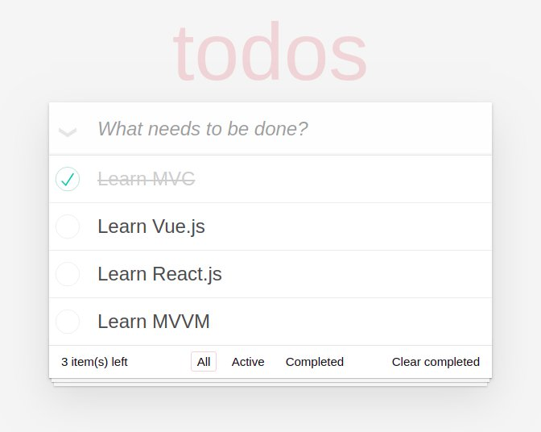

## Polyglot ToDo Mvc



## Live demo (vanilla)

https://js-dev-lab.github.io/PolyglotToDoMvc/

## Features

Project based on [Model View Intend](https://github.com/JS-Dev-Lab/PoormanUiFramework) archicture implementaion providing:

- A generic implementation framework agnostic of todo mvc application
- Bindings for:
    - vanilla implementation
    - Vue.js
    - React.js
    - lit-html
- Time travel 
    - provided by redux chrome extension
    - for all implementation thanks to [mvi.core](ttps://github.com/JS-Dev-Lab/PoormanUiFramework) library

## Run

```bash
npm run serve
```

Specify the view implementation:
```bash
npm run serve -- -app=[implementation]
```

Where `implementation` is one of: `lit-html`, `react`, `vue` or `vanilla`,

